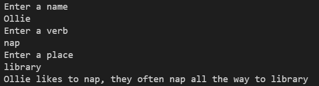

# 1-4 Exercise 3

### The assignment
Create a mad libs program in Python where the user has to enter a name, verb, and a place. You don’t need to follow the example exactly:
  

## Check your work
Select the "Actions" tab on GitHub and select your latest commit. This will show you if your exercise passes all test cases.
